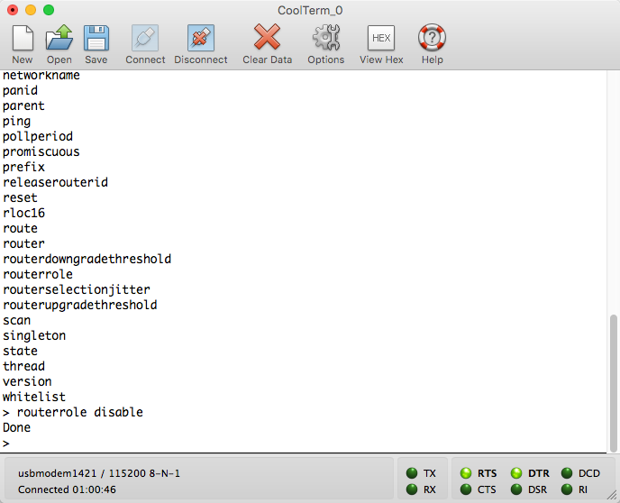

# thread-basic-border-router-example

This repository re-tools what Nordic Semiconductor had created for their [Raspberry
Pi image](https://github.com/NordicSemiconductor/thread_border_router) and enables anyone with a Nordic nRF52840 development board and a computer to connect as an NCP to Wpantund. Thanks to the included Vagrant file very little is needed on the
end user side to get going.

## Install

**Note:** This plugin is useful for automatically installing VirtualBox Guest Additions.
I highly recommend you install it.

    vagrant plugin install vagrant-vbguest

Let's get started:

1. First, change the serial number for your DK in the `Vagrantfile`. It's located
on line 51.

    v.customize ["usbfilter", "add", "0",
      "--target", :id,
      "--name", "J-Link",
      "--manufacturer", "SEGGER",
      "--product", "J-Link",
      "--serialnumber", "000683767824"]

2. Plug your kit into USB.

3. Program using the NCP firmware as provided in the [Nordic Thread SDK](http://infocenter.nordicsemi.com/index.jsp?topic=%2Fcom.nordic.infocenter.threadsdk.v0.8.0%2Findex.html)

    cd nRF5_SDK_for_Thread_v0/examples/thread/experimental/ncp/pca10056/blank/armgcc
    make flash ../../../hex/nrf52840_xxaa.hex

4. Run the `vagrant up` command

    vagrant up

5. Log in to the vagrant box

    vagrant ssh

6. Run the border router

    cd /vagrant/
    chmod 755 ./script/thread_border_router
    sudo ./script/thread_border_router

7. In a separate shell window, you should see a few network interfaces show up
  once wpantund has initialized. Most important to note that both nat64 and wpan0
  has been initialized.

    vagrant@jessie:~$ /sbin/ifconfig
    eth0      Link encap:Ethernet  HWaddr 08:00:27:8d:c0:4d  
              inet addr:10.0.2.15  Bcast:10.0.2.255  Mask:255.255.255.0
              inet6 addr: fe80::a00:27ff:fe8d:c04d/64 Scope:Link
              UP BROADCAST RUNNING MULTICAST  MTU:1500  Metric:1
              RX packets:5843 errors:0 dropped:0 overruns:0 frame:0
              TX packets:5678 errors:0 dropped:0 overruns:0 carrier:0
              collisions:0 txqueuelen:1000
              RX bytes:392092 (382.9 KiB)  TX bytes:544621 (531.8 KiB)

    lo        Link encap:Local Loopback  
              inet addr:127.0.0.1  Mask:255.0.0.0
              inet6 addr: ::1/128 Scope:Host
              UP LOOPBACK RUNNING  MTU:65536  Metric:1
              RX packets:18 errors:0 dropped:0 overruns:0 frame:0
              TX packets:18 errors:0 dropped:0 overruns:0 carrier:0
              collisions:0 txqueuelen:0
              RX bytes:1647 (1.6 KiB)  TX bytes:1647 (1.6 KiB)

    nat64     Link encap:UNSPEC  HWaddr 00-00-00-00-00-00-00-00-00-00-00-00-00-00-00-00  
              inet addr:192.168.255.1  P-t-P:192.168.255.1  Mask:255.255.255.255
              inet6 addr: 2001:db8:1:ffff::1/128 Scope:Global
              inet6 addr: 2001:db8:1::1/128 Scope:Global
              UP POINTOPOINT RUNNING NOARP MULTICAST  MTU:1500  Metric:1
              RX packets:126 errors:0 dropped:0 overruns:0 frame:0
              TX packets:126 errors:0 dropped:0 overruns:0 carrier:0
              collisions:0 txqueuelen:500
              RX bytes:5922 (5.7 KiB)  TX bytes:8442 (8.2 KiB)

    wpan0     Link encap:UNSPEC  HWaddr 00-00-00-00-00-00-00-00-00-00-00-00-00-00-00-00  
              inet6 addr: fdde:ad00:beef:0:c6e4:f108:a9a6:737a/64 Scope:Global
              inet6 addr: fdff:cafe:cafe:cafe:f43d:3e29:fcab:e233/64 Scope:Global
              inet6 addr: fe80::f43d:3e29:fcab:e233/64 Scope:Link
              UP POINTOPOINT RUNNING NOARP MULTICAST  MTU:1280  Metric:1
              RX packets:126 errors:0 dropped:0 overruns:0 frame:0
              TX packets:7 errors:0 dropped:0 overruns:0 carrier:0
              collisions:0 txqueuelen:500
              RX bytes:8442 (8.2 KiB)  TX bytes:672 (672.0 B)

8. On a separate development kit, install the CLI example:

    cd nRF5_SDK_for_Thread_v0/examples/thread/experimental/cli/pca10056/blank/armgcc
    make flash ../../../hex/nrf52840_xxaa.hex

9. Connect to the CLI example using a terminal program. In my case i'm using
  CoolTerm. (11500 Baudrate)

  

10. Ping the border router

    ping 2001:db8:1:ffff::1
    > 8 bytes from 2001:db8:1:ffff:0:0:0:1: icmp_seq=1 hlim=64 time=34ms

11. Ping Google's DNS server

    ping 2001:db8:1:ffff:0:0:808:808
    > 8 bytes from 2001:db8:1:ffff:0:0:808:808: icmp_seq=2 hlim=57 time=43ms

## Going further

  I also modified one of Nordic's Cloud CoAP examples to send data to my CoAP
  server example. Both links are below:

  [nRF52840 Cloud CoAP Example]()
  [Node + Websockets + Express CoAP Server Example]()

## Debugging:

  Sometimes the NCP and the wpantund script get into a bad state. The best way to
  handle is to temporarily un-plug USB and re-connect. Normally this would be
  handled by a GPIO but because we're not using an embedded platform we have to
  manually restart things. I typically watch the wpantund output reinitialize
  to confirm everything is going smoothly.
